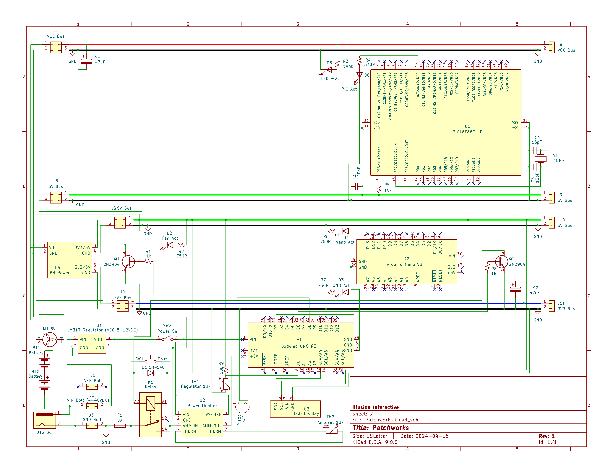

# 💡 Patchworks

This project consists of a set of custom electronics prototyping boards designed for testing and monitoring purposes. Each board features:

- An LCD display
- Voltage, current, and power (V/A/W) gauges
- 3.3V, 5V, and VCC rails (5-12 VDC) for the dual 830 tie-point breadboards
- A main ATmega328P Arduino Uno R3 for system monitoring (e.g., temperature and fan control for the regulator)
- A bare ATmega-based Arduino Nano for breadboard-level microcontroller experimentation
- A bare PIC16F887-IP for similar breadboard-based development (MPLAB X + PICkit 3)

These boards supplement a larger bench setup and include Wi-Fi extensions and additional prototyping space.

---

---

## 🔹 V1.2.0 / Rev 1

- Track fan cycles, store error code in EEPROM + interrogate on startup.

---

## 🔹 V1.1.1 / Rev 1

- Helpers, separations, and general review.

---

## 🔹 V1.0.0 / Rev 1

- Tracking versions. Functionally the same.

---

## 🔹 Ideas & Upcoming Changes

- Change to fixed point arithmetic.
- Contain related variables in structs or convert to fully object oriented to encapsulate fixed point arithmetic, LCD functions, and chip setup, among others.
- Doxygen documentation.

---

## 🔹 General Operation

- Only **one power source** should be used at a time (battery **or** DC input)
  - It is safe to power the Arduino units via USB, regardless of which external power source is selected

- A pushbutton is used to:
  - Initiate a **POST** (Power-On Self-Test)
  - Verify the regulated VCC before engaging the power-on latch

- Holding the button after POST completes will engage the **power-on latch**
- The **power-on latch** is managed by the main Arduino Uno, allowing it to **shut down automatically** under certain fault conditions (temperature or inefficient cooling)

---

## 🔹 Bench Layout Overview

- **Front row (to back):**
  - [7Driver](https://github.com/Broosky/7Driver)
  - [Squarely](https://github.com/Broosky/Squarely)
  - Two Patchworks (this repo), featuring Wi-Fi extensions and the bare PIC MCUs

- **Left side:**
  - [Wattson](https://github.com/Broosky/Wattson)

- **Right side:**
  - Christmas tree

---

